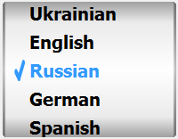
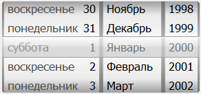
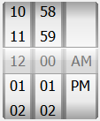
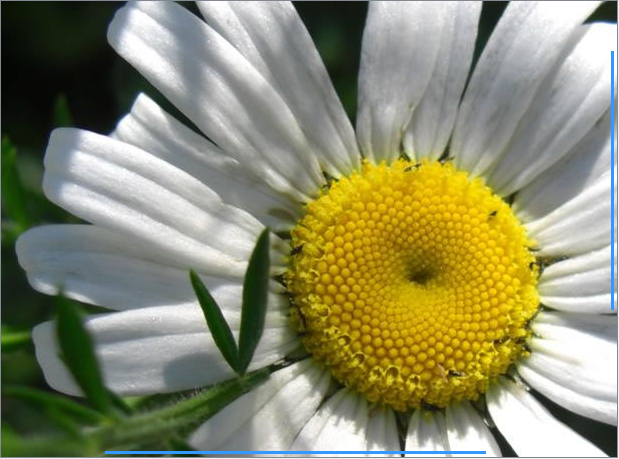
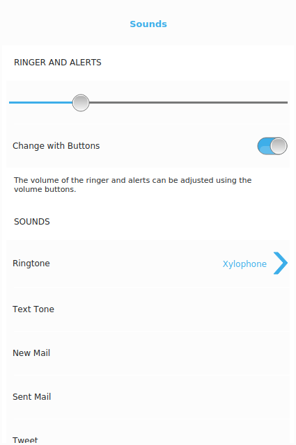
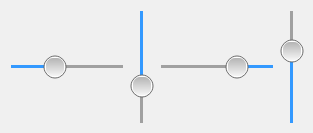

[](https://codecov.io/gh/igormironchik/qtmwidgets)[](https://opensource.org/licenses/MIT)

Library with a set of widgets for mobile development.

# Compilling

Juct run qmake and then make, as usually.

# Examples

Below you can see some widgets from this library. But I've decided to not
provide more examples on this page. This library is in development. Use it
and enjoy it.
            
## Picker

Picker is the list of selectable strings on the cylinder. It looks like iOS Picker but with API like
QComboBox.



```cpp
QtMWidgets::Picker * picker =
    new QtMWidgets::Picker( this );

picker->addItem( QLatin1String( "English" ) );
picker->addItem( QLatin1String( "Russian" ) );
picker->addItem( QLatin1String( "German" ) );
picker->addItem( QLatin1String( "Spanish" ) );
picker->addItem( QLatin1String( "Portuguese" ) );
picker->addItem( QLatin1String( "Belorussian" ) );
picker->addItem( QLatin1String( "Polish" ) );
picker->addItem( QLatin1String( "Ukrainian" ) );

QFont font = picker->font();
font.setBold( true );
font.setPointSize( 15 );

picker->setFont( font );
```
            
## DateTimePicker, DatePicker, TimePicker

DateTimePicker, DatePicker and TimePicker are widgets for selecting date &amp; time, date, time. They
are look similar as correspondence widgets from iOS but have interface as QDateTimeEdit.


```cpp
QtMWidgets::DateTimePicker * picker =
    new QtMWidgets::DateTimePicker( this );

QFont font = picker->font();
font.setPointSize( 13 );

picker->setFont( font );
```


```cpp
QtMWidgets::DatePicker * picker =
    new QtMWidgets::DatePicker( this );

QFont font = picker->font();
font.setPointSize( 13 );

picker->setFont( font );
```



```cpp
QtMWidgets::TimePicker * picker =
    new QtMWidgets::TimePicker( this );

QFont font = picker->font();
font.setPointSize( 13 );

picker->setFont( font );

picker->setFormat( QLatin1String( "hh mm a" ) );
```
            
## Switch

Switch is On/Off button used, for example, in Setting app for options that can be switched.


```cpp
QtMWidgets::Switch * s =
    new QtMWidgets::Switch( this );

QFont f = s->font();
f.setBold( true );
s->setFont( f );

s->setOnText( QLatin1String( "ON" ) );
s->setOffText( QLatin1String( "OFF" ) );
```

## AbstractScrollArea, ScrollArea

AbstractScrollArea and ScrollArea provides possibility of scrolling large widgets that
doesn't fit the screen area.



```cpp
QtMWidgets::ScrollArea * scrollArea =
    new QtMWidgets::ScrollArea( this );

QLabel * imageLabel = new QLabel;
QImage image( ":/flower.jpg" );
imageLabel->setPixmap( QPixmap::fromImage( image ) );

scrollArea->setBackgroundRole( QPalette::Dark );
scrollArea->setWidget( imageLabel );
```

## TableView

TableView is a view with sections with rows (cells). It's very similar to UITableView
from iOS. TableView is widget based view that allows to display sections with rows
(cells). Cell can have accessory widget, for example, Switch. This class is very usefull
for settings of the application.



## Slider

This is the most common slider, almost identical to QSlider.
But it doesn't support styles, but it acceptable to use
on mobile platforms. It has big slider's handle and highlights
position of the handle in the groove.



```cpp
QtMWidgets::Slider * volumeSlider =
    new QtMWidgets::Slider(
        Qt::Horizontal, this );
```

# Donate

[](https://github.com/igormironchik)
